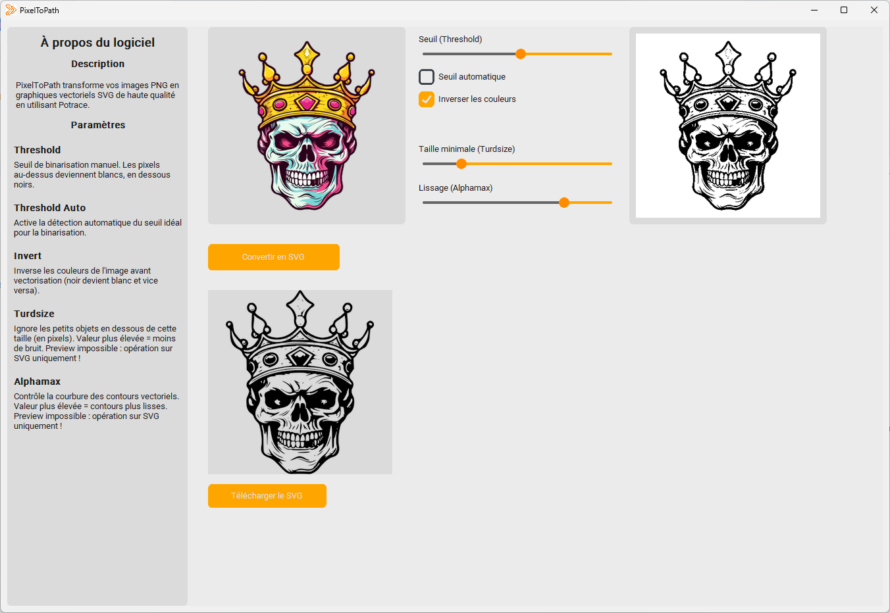

# PixelToPath

Ce logiciel permet de vectoriser des images au format PNG en fichier SVG en utilisant l'outil [Potrace](https://potrace.sourceforge.net/). Il offre plusieurs options pour ajuster la qualité et le style de la vectorisation.

## Version empaquetée

Une version packagée de PixelToPath est disponible dans la section [Releases](https://github.com/lorrisc/PixelToPath/releases/) du dépôt GitHub. Cette version ne nécessite pas d'installation de Python ni de configuration préalable.

### Téléchargement

1. Rendez-vous sur la page des [Releases](https://github.com/lorrisc/PixelToPath/releases/) ;
2. Télécharge le fichier EXE correspondant à la dernière version stable.

### Utilisation

1. Double-cliquez sur PixelToPath.exe ;
2. L’interface graphique s’ouvrira automatiquement ;
3. Vous pouvez importer une image PNG, configurer les paramètres de vectorisation, puis exporter le fichier au format SVG.

### Remarques

- Cette version est compatible avec Windows 64 bits uniquement.
- Potrace est intégré dans l'exécutable : aucune installation supplémentaire n'est nécessaire.
- Si votre antivirus bloque l’application, vous pouvez vérifier l’intégrité du fichier ou l’ajouter à votre liste de confiance (les exécutables générés avec pyinstaller sont parfois faussement détectés comme suspects).

## Version sources

### Prérequis

- Système Windows x64
- Python 3.11.0

### Installation

1. Assurez-vous que Python est installé sur votre système.
2. Créer un environnement et l'activer
```bash
python -m venv env
source env/bin/activate
```
3. Installez les bibliothèques nécessaires avec pip

```bash
pip install -r requirements.txt
```

### Utilisation

1. Exécutez le script :

```bash
python app.py
```

1. Vous pouvez importer une image PNG, configurer les paramètres de vectorisation, puis exporter le fichier au format SVG.

## Exemple

Voici ci-dessous un exemple de l'utilisation de PixelToPath.

- L'image en haut à gauche représente la zone d'import ;
- L'image en haut à droite est une prévisualisation de l'image SVG (il s'agit actuellement d'une image PBM, qui est un format d'image noir et blanc, potrace utilisera cette image pour le calcul)
- L'image en bas est le SVG final (il s'agit en réalité d'une image PNG qui vient de la conversion du fichier SVG).

