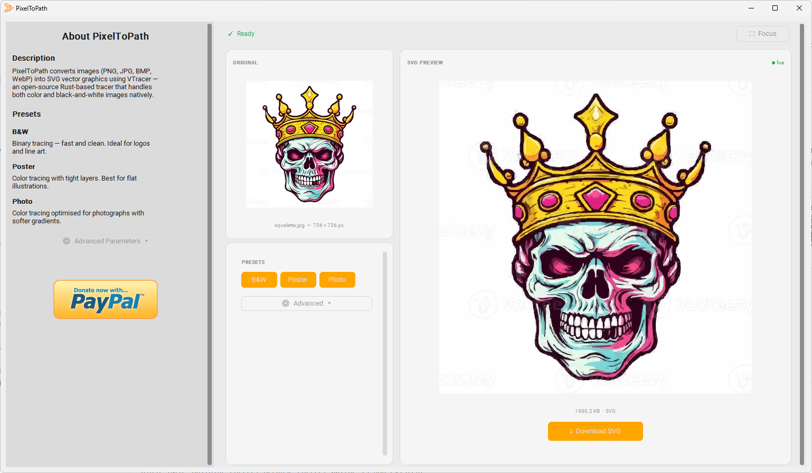

# PixelToPath

PixelToPath converts raster images (PNG, JPG, BMP, WebP) into high-quality SVG vector graphics using [VTracer](https://github.com/visioncortex/vtracer), an open-source Rust-based tracer that handles both color and black-and-white images natively.

## Packaged version

A packaged version of PixelToPath is available in the [Releases](https://github.com/lorrisc/PixelToPath/releases/) section of the GitHub repository. This version requires no Python installation or prior configuration.

### Download 

1. Go to the [Releases](https://github.com/lorrisc/PixelToPath/releases/) page;
2. Download the file matching the latest stable version for your system:
   - `PixelToPath-vX.X.X_Windows.zip` for Windows
   - `PixelToPath-vX.X.X_Linux.tar.gz` for Linux

### Usage

1. Launch PixelToPath;
2. Drag and drop an image or click the import area;
3. Choose a preset (B&W, Poster, Photo) or fine-tune parameters via Advanced mode;
4. The SVG preview updates automatically in real time;
5. Click **Download SVG** to export the file.
   


### Notes

- VTracer is bundled inside the executable — no additional installation required.
- If your antivirus blocks the application, you can verify the file integrity or add it to your trusted list (executables built with PyInstaller are sometimes incorrectly flagged as suspicious).

## Features

- **Supported formats**: PNG, JPG, BMP, WebP
- **Color mode**: multi-layer vectorization with control over color precision and layer difference
- **Black & white mode**: perceptual grayscale conversion with optional invert switch
- **Live preview**: SVG recomputes automatically on every parameter change
- **Presets**: B&W, Poster, Photo for quick results without manual configuration
- **Advanced mode**: access to fine-tuning parameters (Curve Fitting, Filter Speckle, Corner Threshold…)
- **Focus mode**: hides the About panel and the original image to focus on the result (press `Esc` to exit)

## Source version

### Windows

#### Prerequisites

- Python 3.11+

#### Installation

1. Create a virtual environment and activate it
```bash
python -m venv env
.\env\Scripts\Activate
```

2. Install dependencies
```bash
pip install vtracer cairosvg customtkinter tkinterdnd2 Pillow numpy
```

3. Install GTK DLLs for cairosvg (required on Windows) — place the contents of `bin/gtk-bin/` into the `bin/gtk-bin/` folder of the project.

#### Usage
```bash
python app.py
```

### Linux

#### Prerequisites

- Python 3.11+

#### Installation

1. Install system dependencies
```bash
sudo apt install python3-tk python3-venv libcairo2-dev
```

2. Create a virtual environment and activate it
```bash
python3 -m venv env
source env/bin/activate
```

3. Install Python dependencies
```bash
pip install vtracer cairosvg customtkinter tkinterdnd2 Pillow numpy
```

#### Usage
```bash
python3 app.py
```