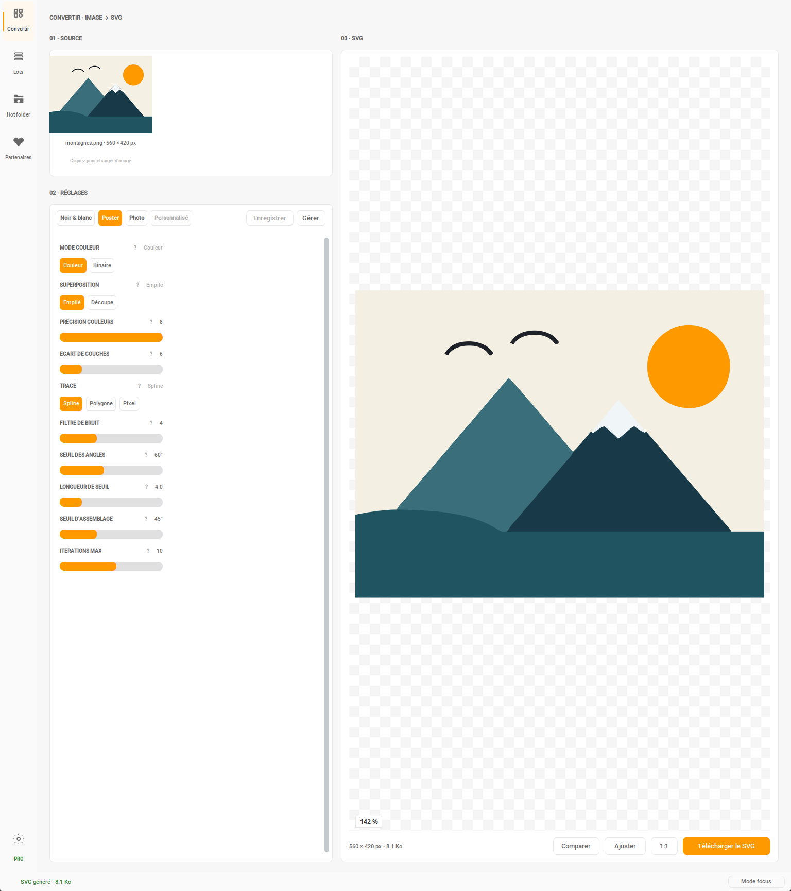

# PixelToPath

PixelToPath converts raster images (PNG, JPG, BMP, WebP) into high-quality SVG vector graphics using [VTracer](https://github.com/visioncortex/vtracer), an open-source Rust-based tracer that handles both color and black-and-white images natively.

## Packaged version

A packaged version of PixelToPath is available in the [Releases](https://github.com/lorrisc/PixelToPath/releases/) section of the GitHub repository. This version requires no Python installation or prior configuration.

### Download

1. Go to the [Releases](https://github.com/lorrisc/PixelToPath/releases/) page;
2. Download the file matching the latest stable version for your system:
   - `Setup_PixelToPath_vX.X.X.exe` for Windows (installer, includes the `ptp` CLI)
   - `PixelToPath-vX.X.X_Windows.zip` for Windows (portable)
   - `PixelToPath-vX.X.X_Linux.tar.gz` for Linux (includes the `ptp` CLI)

### Usage

1. Launch PixelToPath;
2. Drag and drop an image onto the import area;
3. Pick a preset (B&W, Poster, Photo) or fine-tune the parameters — save your own presets at any time;
4. The SVG preview updates automatically, with zoom, pan and a before/after comparison slider;
5. Click **Télécharger le SVG** to export the file.



### Notes

- VTracer is bundled inside the executable — no additional installation required.
- If your antivirus blocks the application, you can verify the file integrity or add it to your trusted list (executables built with PyInstaller are sometimes incorrectly flagged as suspicious).

## Features

- **Supported formats**: PNG, JPG, BMP, WebP
- **Live preview**: SVG recomputes automatically on every parameter change, on a transparency checkerboard
- **Zoom & pan**: wheel zoom anchored at the cursor, drag to pan, Fit / 1:1 buttons, vector re-render at display resolution
- **Before/after comparison**: draggable split slider between the original image and the vector result
- **Dark & light themes**: toggle in the side rail, remembered across sessions
- **Custom presets** (free): save, rename, delete your own parameter sets alongside the built-ins
- **Focus mode**: hides the navigation rail and the import area to focus on the result (press `Esc` to exit)
- **Pro** (license): batch conversion, hot folder watching, and the `ptp` command line — see below

### Pro features

The Pro license is purchased on Lemon Squeezy; the key arrives by e-mail and activates the app on your machine. Image processing itself is 100% offline — only the license check talks to the server (revalidated weekly, 30-day offline grace).

- **Batch conversion**: queue whole folders (drag & drop, recursive), per-file status and progress, automatic collision-free naming (`photo.svg`, `photo-2.svg`…)
- **Hot folder**: watch a directory — every image dropped in is converted to SVG automatically (files are only picked up once fully written)
- **Command line** `ptp`: scriptable conversions, see below

## Command line (Pro)

The `ptp` executable ships with the installer (Windows) and the Linux archive:

```bash
ptp convert drawing.png -o svg-out/ --preset bw
ptp convert scans/*.png -o svg-out/ --preset photo --set filter_speckle=8
ptp convert logo.png -o svg-out/ --preset bw --invert
ptp license activate PASTE-YOUR-KEY
ptp license status
```

- `--preset` accepts the built-ins (`bw`, `poster`, `photo`) and any custom preset saved in the app;
- `--colormode`, `--mode`, `--invert` and `--set key=value` override individual parameters;
- without a license, `ptp convert` explains how to upgrade (exit code 2); conversion failures exit 1.

## Source version

### Windows

#### Prerequisites

- Python 3.11+

#### Installation

1. Create a virtual environment and activate it
```bash
python -m venv env
.\env\Scripts\Activate
```

2. Install dependencies
```bash
pip install vtracer cairosvg customtkinter tkinterdnd2 Pillow numpy
```

3. Install GTK DLLs for cairosvg (required on Windows) — place the contents of `bin/gtk-bin/` into the `bin/gtk-bin/` folder of the project.

#### Usage
```bash
python app.py        # GUI
python cli.py --help # CLI (Pro)
```

### Linux

#### Prerequisites

- Python 3.11+

#### Installation

1. Install system dependencies
```bash
sudo apt install python3-tk python3-venv libcairo2-dev
```

2. Create a virtual environment and activate it
```bash
python3 -m venv env
source env/bin/activate
```

3. Install Python dependencies
```bash
pip install vtracer cairosvg customtkinter tkinterdnd2 Pillow numpy
```

#### Usage
```bash
python3 app.py        # GUI
python3 cli.py --help # CLI (Pro)
```
